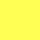

# Design system

The goal of this document it to explain to a common developper how to build a Tic Tac Toe Game with two different playing modes (1 player and 2 players).

## Fonts and Colors


| Font name | Look and feels | Configuration|
|--|--|--|
|Montserrat| | In the `<head>` tag add : `<link href='https://fonts.googleapis.com/css?family=Montserrat' rel='stylesheet'>`


| Colors name | Look and feels |
|--|--|--|
|`#ffffff`|| 
|`#000000`|| 
|`#ffff00`|| 


## Folder Architecture

The code of this game is stored in the public directory
```
public
    ├── assets
    │   └── restart.svg
    ├── docs
    │   └── design_system
    │       └── README.md
    ├── index.html
    ├── scripts
    │   ├── engine.js
    │   └── game.js
    └── styles
        └── style.css
```

The most important files and directories are the `assets/`  `index.html`, `scripts/` and `styles/`.

### HTML and CSS Structure

The `index.html` file contains the web page structure of the application. 

It can be separated into two main elements. the `<header class="scores">` and the `<table id="board">`.

#### Header

It represents the the scores of the game, game mode and the restart button. 
The `<span>` elements with the `scoreValue` class  represent the value of the score which will be changed by JavaScript.

Also lets take note of the `#gameMode` `span` everytime this button is clicked it will alternate the game mode between 2 players and 1 player mode.


```html
    <header class="scores">
      <div>
        <label for="scoreplayerX">PLAYER (X)</label>
        <span class="scoreValue" id="scorePlayerX">0</span>
      </div>
      <div>
        <label for="scoreTie">TIE</label>
        <span class="scoreValue" id="scoreTie">0</span>
      </div>
      <div>
        <label for="scoreplayerO" id="labelPlayerO">PLAYER (O)</label>
        <span class="scoreValue" id="scorePlayerO">0</span>
      </div>
      <div>
        <span id="gameMode">2P</span>
      </div>
      <div >
        <span ></span>
      </div>
    </header>
```


Now regarding the style, all items are displayed inline and centered. This is because we are using `span` elements. Moreover, they are also displayed with space between one another (approximately 50 px). 

This is translated in CSS with:

```css
    .scores{
        font-size: 2em;
        justify-content:  center;
        margin: auto;
        display: flex;
        font-weight: bolder;
    }
    .scores div{
        margin-right: 50px;
    }
    .scoreValue{
        display: block;
        text-align: center;
    }
    #gameMode{
        color: gray;
        cursor: pointer;
    }

```

#### TicTacToe board

The TicTacToe board is a simple board 3 x 3 board, thus we have 3 `<tr>` rows with each 3 `<td>` elements.  The CSS classes will be discussed later, but intuitevely to represent the TicTacToe board every `square` (playing spot) must be the same size and some have no left, right, top, botton borders.

```html
    <table id="board">
      <tr>
        <td class="square no-left-border no-top-border "></td>
        <td class="square no-top-border"></td>
        <td class="square no-right-border no-top-border"></td>
      </tr>
      <tr>
        <td class="square no-left-border"></td>
        <td class="square"></td>
        <td class="square no-right-border"></td>
      </tr>
      <tr>
        <td class="square no-left-border no-bottom-border"></td>
        <td class="square no-bottom-border"></td>
        <td class="square no-right-border no-bottom-border"></td>
      </tr>
    </table>
```

To make the a squares have the same size, we need to set the width and height to the same values. Also, every X an O placed in the square  must be centered. To represent a square with a missing border it is sufficient to set the border side as 0px.


```css
    .square {

        width: 200px;
        height: 200px;
        text-align: center;
        vertical-align: middle;
        border: 5px solid rgb(255, 255, 255);
        cursor: pointer;
    }

    .no-left-border {
        border-left: 0px;
    }
    .no-top-border {
        border-top: 0px;
    }
    .no-right-border {
        border-right: 0px;
    }
    .no-bottom-border {
        border-bottom: 0px;
    }
    #restartButton{
        cursor: pointer;
    }

```


### Events and Calculations scripts

In the `scripts/` folder you will find 2 files named `engine.js` and `game.js.` The `engine.js`  is responsible of all the calculations while `game.js` represents the game state. 

#### Tic Tac Toe Engine

The engine is declared as a variable with several attributes defined as methods to `updateScore` `checkForWin`, `checkForDraw`, get the `nextPlayer`, reset the game, reset the game and scores. To represent the scores it needs attributes to represents the number of ties, wons of player X and player O. 

When `checkForWin` or `checkForDraw` the engine increases the number of wins of the current player, or the number of ties. It does not return `true` or `false` if there is a win but the winning combination so that the `game.js` can represesent the victorious alignment.

#### Tic Tac Toe Game State


