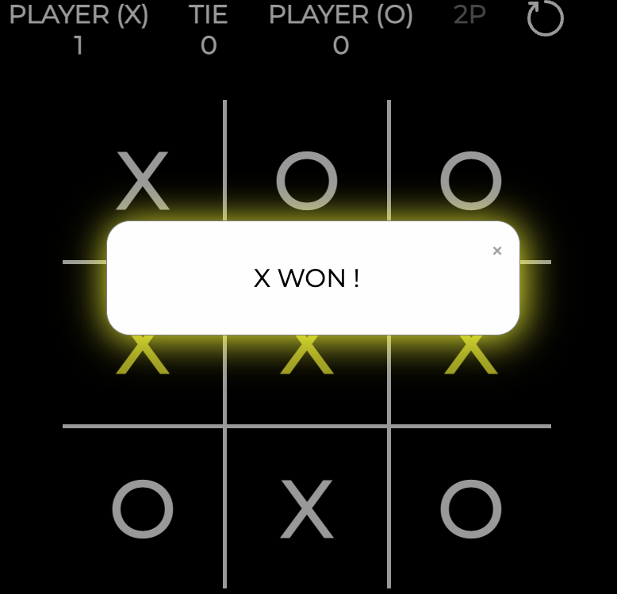
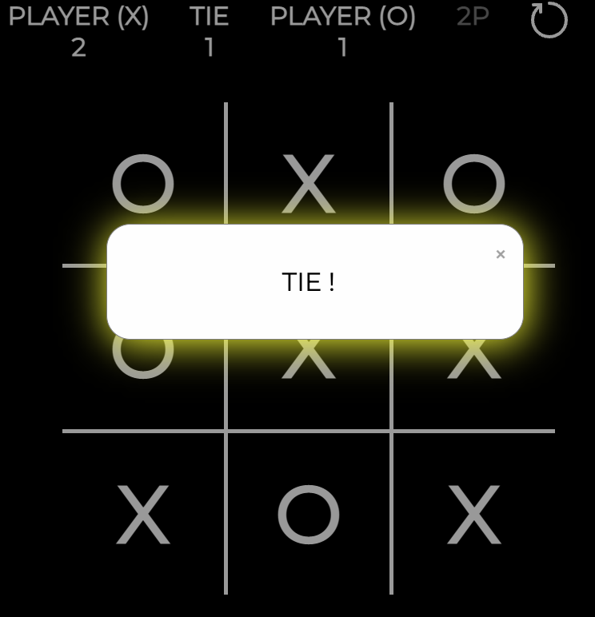

# Tic Tac Toe

## Rules

1. The game is played on a grid that's 3 squares by 3 squares.

2. You are X, your friend (or the computer in this case) is O. Players take turns putting their marks in empty squares.

3. The first player to get 3 of her marks in a row (up, down, across, or diagonally) is the winner.

1. When all 9 squares are full, the game is over. If no player has 3 marks in a row, the game ends in a tie.

## System design

Find the system design [here](public/docs/design_system.md)